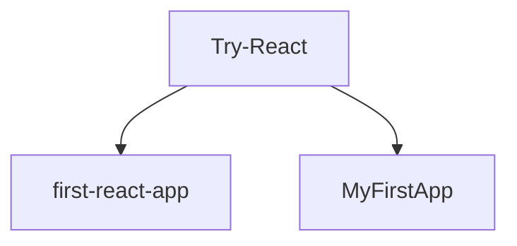

# Learn-React.js

## This Repository is 2017 summer project. I will learn React.js in the next 3 months.

# Try-React:

There is a great intro React book that I fount is easy to follow and understand. (Learning React by Kirupa Chinnathambi). There are some changes and updates which will be importance for the code to run. So please also check out author's websie: <https://www.kirupa.com/>.

--------------------------------------------------------------------------------

- #### In the first-react-app, I tried to followed the: <https://facebook.github.io/react/tutorial/tutorial.html>. And also created a few react apps without Node.js evn.

- #### In the MyFirstApp, I had setup first react local env follow instructions from the books.
